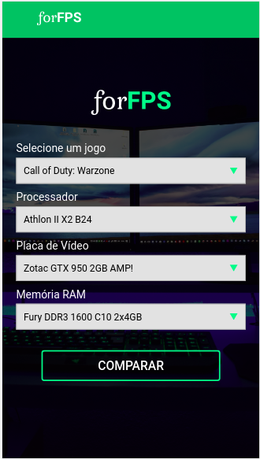

## Sistema Especialista em upgrades de Hardware
Esse projeto foi desenvolvido como um trabalho para a disciplina de Sistema Inteligentes do curso de Análise e Desenvolvimento de Sistemas da ULBRA Torres.
Com ele é possível analisar o hardware da máquina do usuário em relação ao jogo que o mesmo quer jogar, se for necessário o sistema informará um hardware que suprirá sua necessidade.

